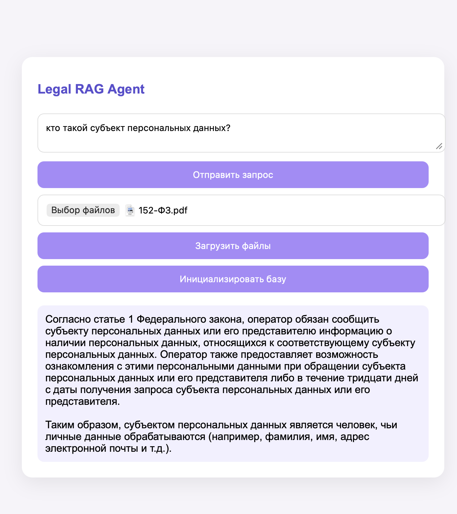
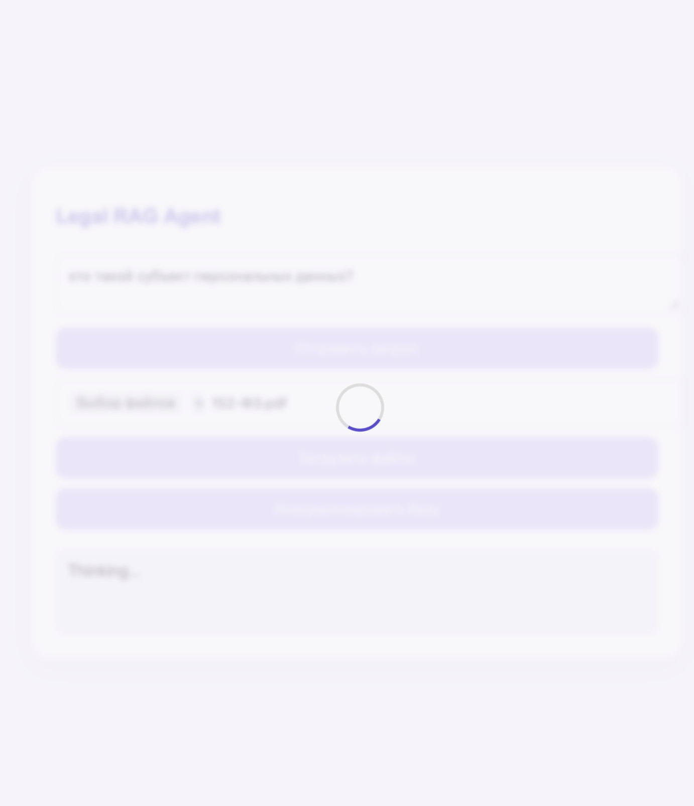

## Legal RAG Agent

RAG-агент для поиска и анализа нормативных документов с использованием гибридного поиска (BM25 + Dense Retrieval) и локальной LLM через Ollama.

## Возможности

* Загрузка PDF и DOCX документов
* Автоматическое построение структуры документа:
    * Глава
    * Раздел
    * Статья
    * Пункт
* Sparse Retrieval (BM25)
* Dense Retrieval (Embeddings)
* Hybrid Search
* Chunk Graph:
    * parent → child
    * sibling navigation
* ReAct Agent с инструментами:
    * retrieve()
    * read_chunk()
    * expand_path()
    * get_neighbors()
* Веб-интерфейс на FastAPI
* Поддержка локальных моделей через Ollama

---

## Архитектура

Документы  
&nbsp;&nbsp;&nbsp;&nbsp;↓  
Парсер  
&nbsp;&nbsp;&nbsp;&nbsp;↓  
Chunk Graph  
&nbsp;&nbsp;&nbsp;&nbsp;↓  
BM25 + Dense Index  
&nbsp;&nbsp;&nbsp;&nbsp;↓  
Hybrid Retriever  
&nbsp;&nbsp;&nbsp;&nbsp;↓  
Tools  
&nbsp;&nbsp;&nbsp;&nbsp;↓  
ReAct Agent  
&nbsp;&nbsp;&nbsp;&nbsp;↓  
LLM

---

## Структура проекта

```text
project/
├── app.py
├── agent.py
├── client.py
├── kb.py
├── tools.py
├── uploads/
├── frontend/
│   └── index.html
├── requirements.txt
└── README.md
```
---

## Установка

1. Клонировать репозиторий
```bash 
git clone https://github.com/suseka2000/legal-graph-rag
cd ./legal-graph-rag
```

2. Собрать и запустить контейнеры
```bash 
docker compose up --build
```

3. После первого запуска в отдельном терминале загрузить модель в контейнер Ollama:
```bash 
docker exec -it ollama ollama pull qwen2.5:7b
```
---

## Запуск приложения

После запуска Docker Compose будут автоматически подняты:

```text
* FastAPI Backend
* Ollama Server
```
Веб-интерфейс API:

```text
http://localhost:8000
```

Если используется frontend из папки frontend, откройте файл index.html в браузере.

---

## Использование


* Загрузите один или несколько PDF/DOCX документов.
* Нажмите кнопку «Инициализировать базу».

Будут автоматически построены:

```text
* Chunk Graph
* BM25 Index
* Dense Index
```

* Введите вопрос на естественном языке.

Например:

```text
Каков срок подачи декларации по НДС?
```

Агент самостоятельно выполнит поиск релевантных фрагментов документации и сформирует ответ с использованием локальной языковой модели.

---

## Конфигурация

Основные параметры приложения находятся в файле .env.

Пример:
```python
MODEL=qwen2.5:7b
TEMPERATURE=0.0
MAX_STEPS=10
EMBEDDING_MODEL=BAAI/bge-small-en-v1.5
OLLAMA_BASE_URL=http://ollama:11434/v1
OLLAMA_API_KEY=ollama
```

После изменения конфигурации необходимо перезапустить контейнеры:

```bash
docker compose up --build
```
---

## Выбор модели

Для использования другой локальной модели достаточно загрузить её в Ollama:

Затем измените параметр MODEL в файле .env:

```python
MODEL=llama3.2
```
После перезапуска контейнеров агент начнет использовать выбранную модель.

Для использования облачных моделей (OpenRouter/OpenAI) достаточно изменить параметры клиента в client.py и указать соответствующий API-ключ в .env.

## Настройка агента
В agent.py можно задать свой SYSTEM_PROMPT:

```python
SYSTEM_PROMPT = """
Ты агент по нормативным документам.

Для ответа используй инструменты.

Алгоритм:
1. Сначала вызови retrieve().
...
"""
```

---
## Пример работы

<table>
  <tr>
    <td align="center">
      <br>
      <b>Рис. 1 — Ответ агента</b>
    </td>
    <td align="center">
      <br>
      <b>Рис. 2 — Загрузка ответа</b>
    </td>
  </tr>
</table>

---

Ограничения

* Качество ответа зависит от качества структуры документа.
* Документы со сложной версткой могут разбираться неидеально.
* Большие коллекции документов требуют дополнительной оптимизации индекса.
* Индексация большого количества документов может занимать некоторое время.

---

Планы развития

* Streaming ответов
* История диалога
* Подсветка источников
* Ранжирование по документам
* Экспорт ответов
* Docker-образ
* Поддержка OpenRouter
* Мультимодальный поиск

---

Лицензия

MIT
