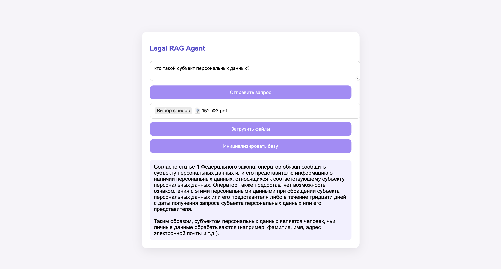

## Legal RAG Agent

RAG-агент для поиска и анализа нормативных документов с использованием гибридного поиска (BM25 + Dense Retrieval) и локальной LLM через Ollama.

## Возможности

* Загрузка PDF и DOCX документов
* Автоматическое построение структуры документа:
    * Глава
    * Раздел
    * Статья
    * Пункт
* Sparse Retrieval (BM25)
* Dense Retrieval (Embeddings)
* Hybrid Search
* Chunk Graph:
    * parent → child
    * sibling navigation
* ReAct Agent с инструментами:
    * retrieve()
    * read_chunk()
    * expand_path()
    * get_neighbors()
* Веб-интерфейс на FastAPI
* Поддержка локальных моделей через Ollama

---

## Архитектура

Документы  
&nbsp;&nbsp;&nbsp;&nbsp;↓  
Парсер  
&nbsp;&nbsp;&nbsp;&nbsp;↓  
Chunk Graph  
&nbsp;&nbsp;&nbsp;&nbsp;↓  
BM25 + Dense Index  
&nbsp;&nbsp;&nbsp;&nbsp;↓  
Hybrid Retriever  
&nbsp;&nbsp;&nbsp;&nbsp;↓  
Tools  
&nbsp;&nbsp;&nbsp;&nbsp;↓  
ReAct Agent  
&nbsp;&nbsp;&nbsp;&nbsp;↓  
LLM

---

## Структура проекта

```text
project/
├── app.py
├── agent.py
├── client.py
├── kb.py
├── tools.py
├── uploads/
├── frontend/
│   └── index.html
├── requirements.txt
└── README.md
```
---

## Установка

1. Клонирование репозитория
   
```python
git clone <repo_url>
cd <repo_name>
```

2. Создание виртуального окружения

macOS / Linux

```bash
python3 -m venv venv
source venv/bin/activate
```

Windows

```bash
python -m venv venv
venv\Scripts\activate
```

3. Установка зависимостей
```bash
pip install -r requirements.txt
```
---

## Установка модели

Установить Ollama:

```text
https://ollama.com
```

Скачать модель, например:

```
ollama pull qwen2.5:7b
```

Запустить Ollama:

```bash
ollama serve
```
---

## Запуск приложения

Запуск веб-сервера:

```bash
uvicorn app:app --reload
```

После запуска открыть:

```text
http://localhost:8000
```

Swagger-документация:

```text
http://localhost:8000/docs
```
---

## Использование

Шаг 1

Загрузить PDF или DOCX документы через веб-интерфейс.

Шаг 2

Нажать кнопку:

```text
Инициализировать базу
```

Будут построены:

* Chunk Graph
* BM25 Index
* Dense Index

Шаг 3

Задать вопрос.

Пример:

```text
Каков срок подачи декларации по НДС?
```
---

## Конфигурация агента

Настройки находятся непосредственно в файлах проекта.

### Выбор модели

В clien.py можно изменить локальную модель или выбрать нелокальную модель

```python
if USE_OLLAMA:

    client = OpenAI(
        base_url="http://localhost:11434/v1",
        api_key="ollama"
    )

else:

    client = OpenAI(
        base_url="https://openrouter.ai/api/v1",
        api_key=os.getenv(
            "OPENROUTER_API_KEY"
        )
    )
```
### Настройка агента
В agent.py можно задать свой SYSTEM_PROMPT:

```python
SYSTEM_PROMPT = """
Ты агент по нормативным документам.

Для ответа используй инструменты.

Алгоритм:
1. Сначала вызови retrieve().
...
"""
```

## Поддерживаемые форматы

* PDF
* DOCX

---

<table>
  <tr>
    <td align="center">
      <br>
      <b>Рис. 1 — Ответ агента</b>
    </td>
    <td align="center">
      <br>
      <b>Рис. 2 — Загрузка ответа и инициалиция базы знаний</b>
    </td>
  </tr>
</table>

⸻

Ограничения

* Качество ответа зависит от качества структуры документа.
* Документы со сложной версткой могут разбираться неидеально.
* Большие коллекции документов требуют дополнительной оптимизации индекса.
* Индексация большого количества документов может занимать некоторое время.

⸻

Планы развития

* Streaming ответов
* История диалога
* Подсветка источников
* Ранжирование по документам
* Экспорт ответов
* Docker-образ
* Поддержка OpenRouter
* Мультимодальный поиск

---

Лицензия

MIT
